# Workflow overview (source: `workflows/job-automation.json`)

This repo treats the exported n8n workflow JSON as the **source of truth**.

## What the workflow does today

- Scrapes ~100 LinkedIn job postings via an **Apify actor**.
- Filters out jobs that mention certain keywords (e.g. PhD/doctoral, intern).
- Pulls your base resume from **Google Docs**.
- Sends each job + resume to an LLM endpoint (currently `integrate.api.nvidia.com`) to classify relevance (`verdict: true/false`).
- If **verdict = true**: appends the job row to Google Sheets.
- If **verdict = false**: asks the LLM to rewrite the resume for that job, creates a new Google Doc, uploads the rewritten content, and appends a row to Google Sheets with that new doc link.

## Node graph (high level)

```mermaid
flowchart LR
  trigger[ManualTrigger] --> config[JobSearchURL_Config]
  config --> scrape[ScrapeJobs_Apify]
  scrape --> filter1[Filter_notPHDs]
  filter1 --> filter2[Filter_intern]
  filter2 --> enrich[MergeResumeLinkFields]
  enrich --> getResume[GetResume_GoogleDocs]
  getResume --> batch[SplitInBatches]
  batch --> classify[LLM_ClassifyJobFit_HTTP]
  classify --> parse[ParseVerdict_Code]
  parse --> ok[Filter_verdictTrue]
  parse --> no[Filter_verdictFalse]
  ok --> appendOk[AppendRow_Sheet]
  no --> rewrite[LLM_RewriteResume_HTTP]
  rewrite --> md[MarkdownToHTML]
  md --> createDoc[CreateDoc_GoogleDocs]
  createDoc --> upload[UploadDocContent_HTTP]
  upload --> appendNo[AppendRow_Sheet_Rewrite]
  appendOk --> batch
  appendNo --> batch
```



## Key improvement themes we implemented in this repo export

- **Configuration centralization**: hardcoded personal info and doc URLs were replaced with placeholders stored in the `Job Search URL` Set node.
- **Privacy/safety**: removed pinned execution data (`pinData`) from the exported JSON before committing, since it can contain full job descriptions and personal details.

## Hybrid auto-apply pipeline (planned)

The hybrid system is split into multiple n8n workflows so the existing LinkedIn workflow stays stable:

```mermaid
flowchart LR
  a[Ingest Jobs\nGitHub + Simplify + LinkedIn outputs] --> b[Dedupe + Normalize\nWrite to `JobPipeline` tab]
  b --> c[Enrich + Tailor\nFit classification + resume/cover artifacts]
  c --> d{Application Gate}
  d -->|Greenhouse allowlist| e[Auto-submit\nvia rtrvr.ai (primary) or browser agent (fallback)]
  d -->|Otherwise| f[Draft/Prefill Queue\nHuman approval required]
  e --> g[Update `JobPipeline`\nstatus=submitted + proof]
  f --> h[Human Approves\nthen submit on next run]
  h --> e
```

In this design, `JobPipeline` is the control-plane (idempotency via `job_hash`, and routing via `application_mode` + `application_status`). Yellow/red boxes are driven by `application_status` and `missing_fields` using conditional formatting in Google Sheets.

